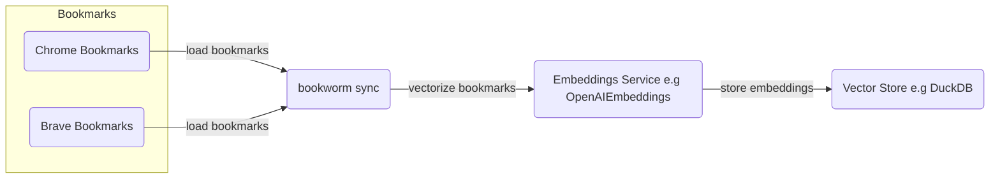
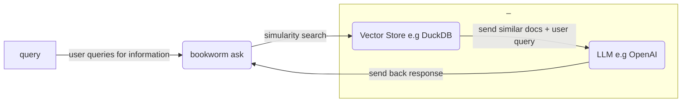

# bookworm

### Processes 

*`bookworm sync`*

```python
python -m bookworm sync
```



---

*`bookworm ask`*

```python
python -m bookworm ask
```



---


### Developer Setup 

```bash
# LLMs
export OPENAI_API_KEY=

# Langchain (optional, but useful for debugging)
export LANGCHAIN_API_KEY=
export LANGCHAIN_TRACING_V2=true
export LANGCHAIN_PROJECT=bookworm

# Misc (optional)
export LOGGING_LEVEL=INFO
```

Recommendations:

- Install [`pyenv`](https://github.com/pyenv/pyenv?tab=readme-ov-file#installation) and ensure [build dependencies are installed](https://github.com/pyenv/pyenv?tab=readme-ov-file#install-python-build-dependencies) for your OS.
- Install [Poetry](https://python-poetry.org/docs/) we will be using [environment management](https://python-poetry.org/docs/managing-environments/) below.


```bash
poetry env use 3.9 # or path to your 3.9 installation

poetry shell
poetry install

bookworm --help
```
