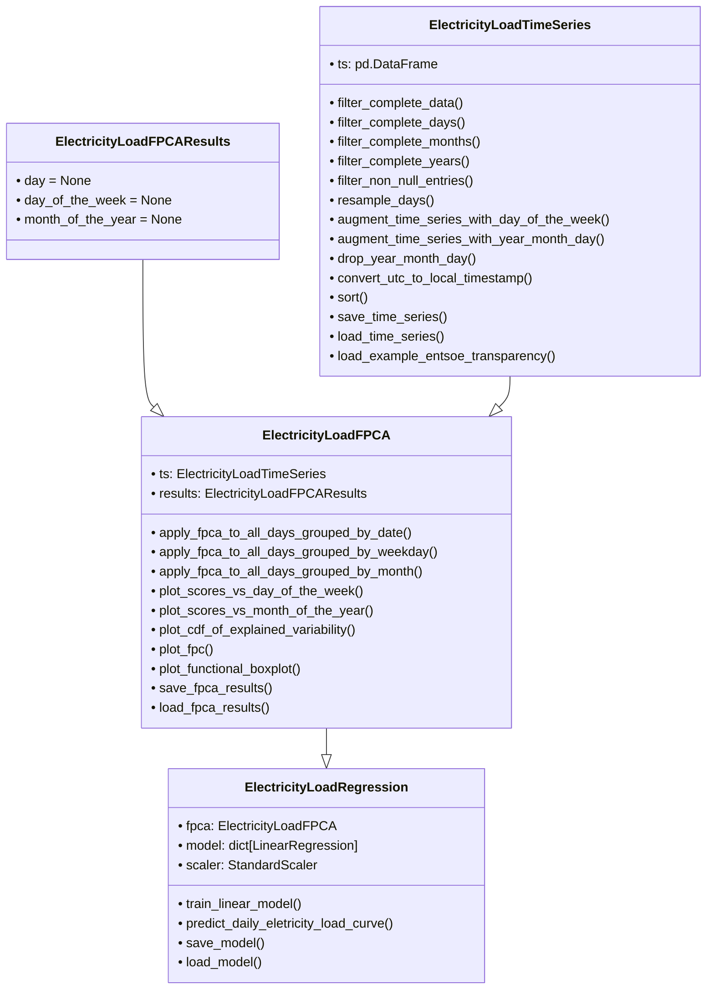

# Functional Principal Component Analysis and Functional Regression Tools for Electricity Load Curves

Based on the work by [**D. Beretta et al.**, *Sustainable Energy, Grids and Networks, Volume 21, March 2020,
100308*](https://www.sciencedirect.com/science/article/abs/pii/S2352467719304461).
Readers are encouraged to consult the manuscript to master the methodology.

These tools are designed for scientists, researchers, and engineers working in all fields of electrical grid
optimization. They provide capabilities to apply FPCA to daily electricity load curves and predict future
consumption patterns based on historical data.

<!-- TOC -->
* [Installation](#installation)
* [Overview](#overview)
* [Time Series](#time-series)
  * [Loading time series](#loading-time-series)
  * [Converting between UTC and Local time](#converting-between-utc-and-local-time)
  * [Filtering complete time-series](#filtering-complete-time-series)
* [FPCA](#fpca)
  * [Applying FPCA](#applying-fpca)
  * [Saving and loading FPCA results](#saving-and-loading-fpca-results)
  * [Displaying FPCA results](#displaying-fpca-results)
* [Functional Regression](#functional-regression)
  * [The model](#the-model)
  * [Prediction](#prediction)
  * [Loading and Saving](#loading-and-saving)
* [Contributing](#contributing)
* [Credits](#credits)
* [License](#license)
<!-- TOC -->

## Installation

The `fpca-load-tools` can be installed either via pip or by cloning this repository.

To install the tools via pip, use the following commands based on your operating system:

- **On Unix/Mac**: Open a terminal and run:
  ```bash 
  pip install fpca-load-tools
- **On Windows**: Open Command Prompt or PowerShell and run:
  ```bash
  pip install fpca-load-tools

To install the app by cloning the repository to your local machine, follow these steps:

- Clone the repository:
  ```bash
  git clone https://github.com/BerriesLab/fpca-load-tools.git
- Navigate to the project directory:
  ```bash
  cd project-name
- Install the required dependencies:
  ```bash
  pip install -r requirements.txt

## Overview

**fpca-load-tools** is designed around three main classes:

- [`ElectricityLoadTimeSeries`](fpca_load_tools/time_series.py): Manages time series data within a Pandas DataFrame, including
  pre-processing operations such as filtering for complete time series and augmenting time series with calendar
  information.
- [`ElectricityLoadFPCA`](fpca_load_tools/fpca.py): Applies Functional Principal Component Analysis (FPCA) to daily
  electricity load curves. This class requires an ElectricityLoadTimeSeries object as attribute.
    - **Note 1**: The ElectricityLoadTimeSeries object is stored as a reference in ElectricityLoadFPCA. Therefore, any
      changes made to the ElectricityLoadTimeSeries object outside ElectricityLoadFPCA will also affect the data being
      processed by the FPCA.
    - **Note 2**: The results of the FPCA, including the scores, are stored in the *results* attribute of the class.
- [`ElectricityLoadRegression`](fpca_load_tools/prediction.py): Trains a model and predicts daily electricity load curves
  using FPCA data. It requires an ElectricityLoadFPCA object as attribute.
    - **Note 1**: The ElectricityLoadFPCA object is stored as a reference in ElectricityLoadRegression.Therefore, any
      modifications to the ElectricityLoadFPCA object outside ElectricityLoadRegression will affect the data being
      processed by the regressor.
    - **Note 2**: The results of the training are stored in the class attributes '**model**' and '**scaler**'.

The following figure is a graphical representation of the classes with their own attributes and methods.



## Time Series

### Loading time series

Users can load time series from CSV files using the [`load_time_series()`](fpca_load_tools/time_series.py) method of the
ElectricityLoadTimeSeries class. The expected data structure in the CSV file is:

| utc_timestamp | load | feature_1 | feature_2 | ... | feature_n |
|---------------|------|-----------|-----------|-----|-----------|
| ...           | ...  | ...       | ...       | ... | ...       |

- utc_timestamp: The timestamp in Coordinated Universal Time (UTC) or Greenwich Mean Time (GMT).
- load: The electricity load measurement.
- feature_1 to feature_n: Additional features for analysis and/or prediction.

Upon loading, the CSV file is converted into a Pandas DataFrame with a **DateTimeIndex** based on the **utc_timestamp**.

Users can load multiple files and features as needed. The method automatically merges new CSV files with the existing
DataFrame in memory on the **DateTimeIndex**. Users should ensure that only one column named **load** is present in
memory. To help the user, [`load_time_series()`](fpca_load_tools/time_series.py) allows to select which columns to load from
teh CSV file and to choose the names for these columns in the destination DataFrame. If multiple columns with the same
name are loaded, Pandas will handle them by renaming the new columns with suffixes (e.g., **column_name_r**).

An example of meteorological time series data that could be merged with the electricity load time series is:

| utc_timestamp | temperature | radiation | relative_humidity |
|---------------|-------------|-----------|-------------------|
| ...           | ...         | ...       | ...               |

To save time series data to CSV files, users can use the [`save_time_series()`](fpca_load_tools/time_series.py) method.

### Converting between UTC and Local time

When studying electricity load time series, the choice between using UTC (Coordinated Universal Time) and local time
depends on the objectives of the analysis and the nature of the data. For standardization purposes, such as comparing
electricity load across different time zones, using UTC provides a uniform time reference and simplifies time zone
conversions. However, if the goal is to investigate **consumer behavior**, local time may be more relevant since
electricity load often correlates with human activities and routines, which follow local time patterns (e.g., peak load
times during mornings and evenings). Similarly, for **operational planning**, such as scheduling generation or demand
response activities, local time aligns better with the actual timing of events and conditions experienced by consumers
and grid operators.

To facilitate this, the [`ElectricityLoadTimeSeries`](fpca_load_tools/time_series.py) class includes the
method [`convert_utc_to_local_timestamp`](fpca_load_tools/time_series.py), which converts the UTC DateTimeIndex to the
corresponding local timestamp. This method requires the user to specify the geographical area in [Olson Timezone](https://en.wikipedia.org/wiki/List_of_tz_database_time_zones) format.

It is important to note that converting from UTC to local time, including accounting for daylight saving time, can
result in days with duplicate entries or missing values. To address these issues, you can either resample the days with
duplicates or missing entries or remove days that do not meet completeness and integrity requirements. For detailed
guidance on handling these issues, see the section on [**Filtering complete time series**](#Filtering-complete-time-series)

### Filtering complete time-series

To execute FPCA and predict future electricity load curves, it is essential that the dataset is complete. The
completeness criteria are as follows:

- **Year Completeness**: A year is considered complete if the number of months with non-null entries meets or exceeds a
  tolerance percentage of the expected number of months, which is 12. By default, this tolerance level is set to 11/12.
- **Month Completeness**: A month is considered complete if the number of days with non-null entries meets or exceeds a
  tolerance percentage of the expected number of calendar days. By default, this tolerance level is set to 95% of the
  month's calendar days.
- **Day Completeness**: A day is considered complete if the number of non-null entries meets or exceeds a tolerance
  percentage of the expected number of entries. By default, this tolerance level is set to 100% of the expected entries.

To filter a complete dataset, the user can use the [`filter_complete_data()`](fpca_load_tools/time_series.py) method
from the [`ElectricityLoadTimeSeries`](fpca_load_tools/time_series.py) class. This method utilizes four sequentially
executed methods:

1. [`filter_non_null_entries()`](fpca_load_tools/time_series.py): Delete all rows with at least one `None` value.
2. [`filter_complete_years()`](fpca_load_tools/time_series.py): Remove incomplete years. The default tolerance is set to
   11/12.
3. [`filter_complete_months()`](fpca_load_tools/time_series.py): Remove incomplete months. The default tolerance is set to 95%
   of the month’s calendar days.
4. [`filter_complete_days()`](fpca_load_tools/time_series.py): Remove incomplete days. The default tolerance is set to 100% of the
   mode of the time series grouped by date.

**Note 1**: As the first step, entries with null data are dropped by the [`filter_non_null_entries`](fpca_load_tools/time_series.py) method. This is
essential because the subsequent methods only evaluate the DateTimeIndex values, regardless of the columns actual values.

**Note 2**: When filtering days with a tolerance level less than 100% or converting timestamps from UTC to local time, the
resulting time series may include missing values. To address this, the user can use
the [`resample_days()`](fpca_load_tools/time_series.py) method. This method resamples the time series daily with a
user-defined frequency (defaulting to one hour). Missing values are linearly interpolated between their nearest
neighbors, and any remaining None values at the beginning or end of an interpolated period are filled with the nearest
neighbor value.

## FPCA

The standard PCA in scikit-learn expects a 2D data matrix where each row represents a sample and each column represents
a feature. In the context of FPCA, the "features" are values of the functions at discretized points.

### Applying FPCA

The class [`ElectricityLoadFPCA`](fpca_load_tools/fpca.py) offers three methods to apply three different types of FPCAs:

- [`apply_fpca_to_all_days_grouped_by_date()`](fpca_load_tools/fpca.py): Applies FPCA to daily curves grouped by date.
- [`apply_fpca_to_all_days_grouped_by_weekday()`](fpca_load_tools/fpca.py): Applies FPCA to daily curves grouped by day of
  the week.
- [`apply_fpca_to_all_days_grouped_by_month()`](fpca_load_tools/fpca.py): Applies FPCA to daily curves grouped by month of
  the year.

The results from each FPCA are stored in an instance of the [`ElectricityLoadFPCAResults`](fpca_load_tools/fpca.py)
class, which is the '**results**' attribute of [`ElectricityLoadFPCA`](fpca_load_tools/fpca.py).Note that only one result
per FPCA type can be stored at a time: performing an analysis again will overwrite any previous results. For example,
running [`apply_fpca_to_all_days_grouped_by_date()`](fpca_load_tools/fpca.py) a second time will replace the results from the
first analysis.

### Saving and loading FPCA results

FPCA results can be saved to and loaded from a pickle file on disk using the following methods:

- [`save_fpca_results()`](fpca_load_tools/fpca.py)
- [`load_fpca_results()`](fpca_load_tools/fpca.py).

### Displaying FPCA results

The [`ElectricityLoadFPCAResults`](fpca_load_tools/fpca.py) class provides several plotting methods for visualizing
FPCA results, similar to the visualizations reported in **D. Beretta et al.**, *Sustainable Energy, Grids and Networks,
Volume 21, March 2020, 100308*. These methods include:

- [`plot_functional_boxplot()`](fpca_load_tools/fpca.py): Plots a functional boxplot that overlays all daily load curves with median and
  interquartile bands.

<div id="fig_params" align="center"> 
    
    <p><b>Figure 1:</b> Functional boxplot for a representative dataset.</p>
</div>

- [`plot_fpc()`](fpca_load_tools/fpca.py): Plots the Functional Principal Components (FPCs), rescaled according to their explained variance ratio.

<div id="fig_params" align="center"> 
    
    <p><b>Figure 2:</b> FPCs of a representative dataset rescaled by their explained variance ratio.</p>
</div>

- [`plot_cdf_of_explained_variability()`](fpca_load_tools/fpca.py): Plots the Cumulative Distribution Function (CDF) of the explained
  variability percentage as a function of the number of FPCs. 

<div id="fig_params" align="center"> 
    
    <p><b>Figure 3:</b> CDF of a representative dataset.</p>
</div>

- [`plot_scores_vs_day_of_the_week()`](fpca_load_tools/fpca.py): Plots a boxplot of FPC scores versus the day of the week for the first n FPCs. 

<div id="fig_params" align="center"> 
    
    <p><b>Figure 4:</b> Scores boxplot of a representative dataset vs day of the week.</p>
</div>

- [`plot_scores_vs_month_of_the_year()`](fpca_load_tools/fpca.py): Plots a boxplot of FPC scores versus the month of the year for the first n FPCs. 

<div id="fig_params" align="center"> 
    
    <p><b>Figure 5:</b> Scores boxplot of a representative dataset vs month of the year.</p>
</div>


**Note**: All above methods collect the data to plot from the [`ElectricityLoadFPCA`](fpca_load_tools/fpca.py) class' attributes. 

## Functional Regression

FPCA can be integrated into any time-series predictive model to predict daily electricity load curves. Unlike
traditional time-series models that predict actual data, FPCA-based models predict the scores of a selected number of
Functional Principal Components (FPCs). This approach balances model complexity and explained variability. For more
details on this methodology, refer to [**D. Beretta et al.**, *Sustainable Energy, Grids and Networks, Volume 21, March
2020, 100308*](https://www.sciencedirect.com/science/article/abs/pii/S2352467719304461).

### The model

The functional decomposition allows to cast the electricity load curve of a given day in the form:

$$f^{(i)}(t) = \sum{c^{(i)}_k \phi_k} $$

where $f(t)$ is the electricity load curve of the i-th day, $c^{(i)}_k$ is the score of the k-th FPC for the i-th day,
and $\phi_k$ is the k-th FPC of the time series grouped by date. The $c^{(i)}_k$ can be estimated with the linear model:

$$ 
c_k^{(i)} = w_k^{(i)} + w_{k,1}^{(i)} * x_1^{(i)} + w_{k,2}^{(i)} * x_2^{(i)} + ... + w_{k,m}^{(i)} x_m^{(i)} 
$$

where $c_k^{(i)}$ is the score of the k-th FPC for the i-th day, $x_l^{(i)}$ is the l-th feature for the i-th day, and
$w_{k,l}^{(i)}$ is the l-th feature weight for the k-th FPC of the i-th day.

**Note**: Since the model predicts the FPCs scores, and since the FPCs are daily time series, the features must be
averaged over the day, e.g. the average temperature of the day.

### Prediction

The class [`ElectricityLoadRegression`](fpca_load_tools/prediction.py) handles the prediction process. It can be instantiated with or 
without passing an instance of [`ElectricityLoadFPCA`](fpca_load_tools/fpca.py).

The [`ElectricityLoadRegression`](fpca_load_tools/prediction.py) class provides a method for training a linear model and a method for
predicting the electricity load curves. Specifically:

- [`train_linear_model()`](fpca_load_tools/prediction.py): Trains the model described in section [**The model**](#The-model) 
iteratively on the first n FPCs using [scikit-learn LinearRegression](https://scikit-learn.org/stable/modules/generated/sklearn.linear_model.LinearRegression.html). This results in n weight matrices, 
one for each FPC, which are stored as part of the respective objects in the class '**model**' attribute. 

<div id="fig_params" align="center"> 
    
    <p><b>Figure 6:</b> Actual vs predicted scores of FPC1 for a representative dataset.</p>
</div>

- [`predict_daily_electricity_load_curve()`](fpca_load_tools/prediction.py): Predicts the electricity load curve for a specified future date,
and returns a list of prediction metrics, including the percentage power error.

<div id="fig_params" align="center"> 
    
    <p><b>Figure 7:</b> Actual vs predicted electricity load curve.</p>
</div>

### Loading and Saving

The ElectricityLoadRegression class includes methods for saving and loading the model parameters and the feature scaler:

- [`save_model()`](fpca_load_tools/prediction.py): Saves the model and feature scaler to pickle file.
- [`load_model()`](fpca_load_tools/prediction.py): Loads a previously saved model and feature scaler from pickle file.

## Contributing

Please read [CONTRIBUTING.md](CONTRIBUTING.md) for details on our code of conduct, and the process for submitting pull
requests.

## Credits

This app has been developed by **D. Beretta**, building on the work by **D. Beretta et al.**, *Sustainable Energy, 
Grids and Networks, Volume 21, March 2020, 100308*. Please refer to [CREDITS.md](CREDITS.md) and [CITATION.md](CITATION.cff) 
for more details.

## License

This project is licensed under the GNU License - see the [LICENSE](LICENSE) file for details.


